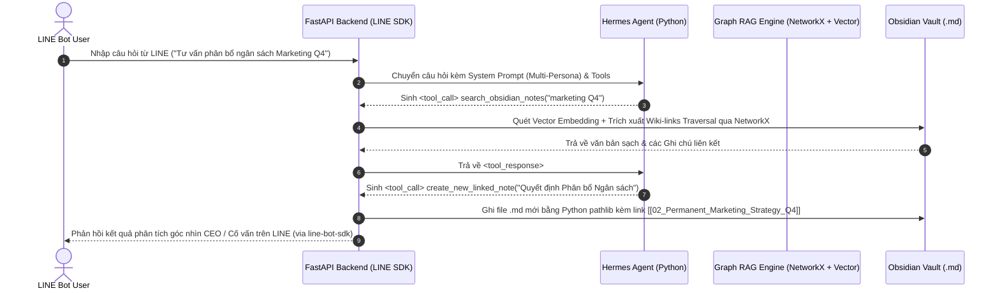
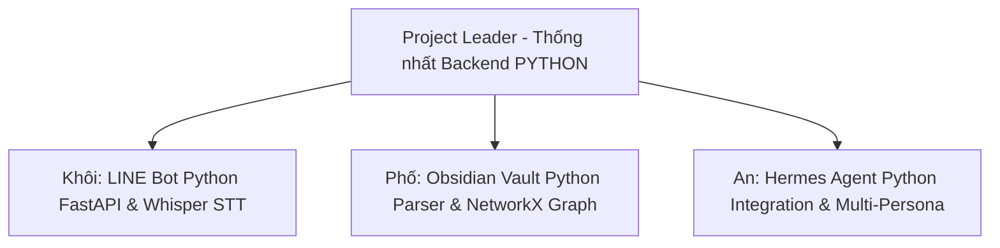

# TỔNG HỢP TÀI LIỆU KHẢO SÁT & ĐỊNH HƯỚNG KIẾN TRÚC HỆ THỐNG
## DỰ ÁN: BỘ NÃO THÔNG MINH THỨ HAI (SECOND BRAIN AI PRODUCT)
**Vai trò:** Project Leader (PL) - Team Sản phẩm AI Tri thức / Thiên tài  
**Tình trạng:** Khảo sát Kỹ thuật & Tổng hợp Tài liệu Tham khảo Master  
**Ngôn ngữ Backend Thống nhất:** **PYTHON 3.10+** (FastAPI + LINE Python SDK + Python Obsidian Parser + Hermes Agent / Graph RAG)

---

## MỤC LỤC
1. [Phương pháp luận Quản lý Tri thức (Core Methodology)](#1-phương-pháp-luận-quản-lý-tri-thức-core-methodology)
2. [Hệ sinh thái Obsidian (Data Layer & Knowledge Graph)](#2-hệ-sinh-thái-obsidian-data-layer--knowledge-graph)
3. [Kiến trúc AI & Agent (Intelligence Layer)](#3-kiến-trúc-ai--agent-intelligence-layer)
4. [Giao diện & Trải nghiệm Người dùng (UI/UX Layer)](#4-giao-diện--trải-nghiệm-người-dùng-uiux-layer)
5. [Kế hoạch Vận hành & Phân công Công việc (PL Management)](#5-kế-hoạch-vận-hành--phân-công-công-việc-pl-management)
6. [Tài liệu Báo cáo & Quy trình Làm việc với JP (JP Reporting Mechanism)](#6-tài-liệu-báo-cáo--quy-trình-làm-việc-với-jp-jp-reporting-mechanism)

---

## 1. Phương pháp luận Quản lý Tri thức (Core Methodology)

Khách hàng hướng tới việc xây dựng sản phẩm thành một **"Bộ脑 thứ hai" (Second Brain)** giúp giảm tải áp lực ghi nhớ cho con người, hỗ trợ tư duy và liên kết tri thức tự động.

```mermaid
graph TD
    A[Ghi nhận Ý tưởng qua LINE Bot] --> B[Fleeting Notes / Ghi chú thoáng qua]
    B --> C[Phân tích & Đúc kết]
    C --> D[Literature Notes / Ghi chú tài liệu]
    D --> E[Permanent Notes / Ghi chú vĩnh viễn]
    E --> F[Bi-directional Linking [[Wiki-links]]]
    F --> G[Emergence of New Ideas / Tri thức Mới Phát sinh]
```

---

## 2. Hệ sinh thái Obsidian (Data Layer & Knowledge Graph)

Obsidian đóng vai trò làm trung tâm lưu trữ dữ liệu (Data Storage & Knowledge Graph Layer).

### 2.1 Cấu trúc Dữ liệu Obsidian & Thao tác Thủ công
* **YAML Frontmatter (Metadata Header):** Đặt ở đầu file giữa 2 cặp `---`:
  ```yaml
  ---
  title: Chiến lược Marketing Q4
  date: 2026-10-05
  tags: [marketing, strategy, permanent]
  category: Permanent Notes
  status: active
  aliases: [Strategic Marketing Q4]
  ---
  ```
* **Wiki-links (Internal Links):** Cú pháp `[[Tên_file]]` hoặc `[[Tên_file|Văn bản hiển thị]]`.
* **Thao tác trên Obsidian Desktop/Mobile:**
  1. *Tạo Frontmatter:* Gõ `---` ở dòng đầu rồi nhấn `Enter` hoặc dùng `Ctrl + P` $\rightarrow$ `Add file property`.
  2. *Tạo Wiki-links:* Gõ `[[` mở popup gợi ý danh sách note, gõ `|` để đổi nhãn hiển thị. Xem liên kết đồ thị bằng **Graph view**.

### 2.2 Sứ mệnh Tự động hóa của Hệ thống AI Backend (Team triển khai)
* **Bài toán thực tế:** Người dùng phổ thông rất lười hoặc không biết gõ Frontmatter YAML, không tự kết nối các note bằng `[[...]]`.
* **Nhiệm vụ của AI Backend Python:** Khi người dùng gửi 1 tin nhắn ngắn hoặc voice note từ LINE/App (ví dụ: *"Hôm nay họp với Kenichi chốt tách dự án làm 2 team"*), Backend AI sẽ tự động:
  1. **Tự tạo Frontmatter:** Gán thẻ tag `#meeting`, thời gian, người tham gia.
  2. **Tự tạo Wiki-links:** Nhận diện thực thể trong câu (`Kenichi`, `Dự án AI Thư ký`) và tự động chuyển thành link `[[Kenichi]]`, `[[AI Thu ky]]`.
  3. **Lưu file `.md` hoàn chỉnh vào Vault:** Tự động tạo mạng lưới tri thức sống động mà người dùng không cần thao tác thủ công phức tạp.

### 2.3 Phân tách & Trích xuất bằng Code Python

| Thư viện / Tool | Ngôn ngữ | Đặc điểm kỹ thuật | Phù hợp với |
| :--- | :--- | :--- | :--- |
| **`python-frontmatter`** | Python | Thư viện chuẩn nhất để bóc tách phần `metadata` (YAML object chứa `tags`, `date`, `aliases`, `category`) và `content` (thân bài viết). | Tách Frontmatter metadata |
| **`re` (Python Regex module)** | Python | Trích xuất chuẩn xác cú pháp `\[\[([^\]\|]+)(?:\|([^\]]+))?\]\]` lấy target note và display text. | Trích xuất Outgoing Links |
| **`networkx`** | Python | Thư viện xử lý đồ thị mạnh mẽ hàng đầu của Python, dùng để dựng Nodes/Edges và tính Backlinks. | Build Knowledge Graph & Backlinks |
| **`faster-whisper`** | Python | Tích hợp trực tiếp Whisper STT xử lý file ghi âm giọng nói từ LINE Bot. | Voice-to-Text Pipeline |

---

## 3. Kiến trúc AI & Agent (Intelligence Layer)

Tầng trí tuệ nhân tạo không chỉ dừng lại ở tìm kiếm từ khóa mà đóng vai trò làm **Agent tư duy, lập luận và đóng vai nhiều góc nhìn**.

### 3.1 Khảo sát Hermes Agent (Nous Research)
* **Bản chất của Hermes:** Dòng mô hình mã nguồn mở thế hệ mới (OpenHermes, Nous-Hermes-2, Hermes 3) phát triển bởi Nous Research, nổi tiếng với khả năng **Function Calling / Tool Calling** và **Structured Output (JSON mode)**.
* **ChatML Prompt Format đặc thù:** Sử dụng cú pháp thẻ mở/đóng rõ ràng: `<tools>`, `<tool_call>`, `<tool_response>`.

### 3.2 Mô hình Agentic Graph RAG với Obsidian Vault trong Python



---

## 4. Giao diện & Trải nghiệm Người dùng (UI/UX Layer)

### 4.1 LINE Bot Integration với Python (`line-bot-sdk`)
* **SDK Chính thức:** Dùng thư viện `line-bot-sdk` chính thức của LINE Corporation trên Python.
* **Web Framework:** **FastAPI** xử lý Webhook bất đồng bộ (`async/await`) tốc độ cao.
* **Voice-to-Text STT:** File ghi âm gửi qua LINE Bot được truyền trực tiếp vào pipeline Python sử dụng **`faster-whisper`** để chuyển văn bản tức thì.

---

## 5. Kế hoạch Vận hành & Phân công Công việc (PL Management)



1. **Khôi (LINE Bot Python SDK & STT Pipeline):** Webhook LINE Bot Python SDK & `faster-whisper`.
2. **Phố (Obsidian Vault Data Layer & Python Parser):** Module Python (`python-frontmatter` + `re` + `networkx`) tự động phân tách Frontmatter & tạo Wiki-links tự động cho user.
3. **An (AI Intelligence Layer & Hermes Agent Python):** Hermes Agent Tool Calling & Multi-Persona Prompts.

---

## 6. Tài liệu Báo cáo & Quy trình Làm việc với JP (JP Reporting Mechanism)

### 6.1 Xác nhận Quyết định Kỹ thuật với JP
- **Đề xuất Thống nhất Ngôn ngữ Backend:** Báo cáo với đại diện JP về quyết định thống nhất sử dụng **Python** cho toàn bộ Backend.
