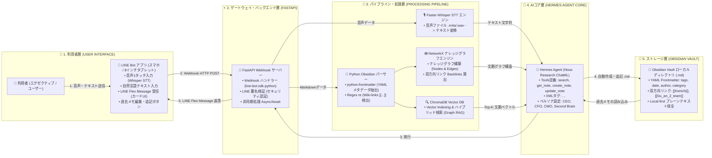

# CÁC FILE VẼ SƠ ĐỒ KIẾN TRÚC HỆ THỐNG (SYSTEM ARCHITECTURE DIAGRAM CODE)
**Dự án:** Người làm cho con người trở thành Thiên tài AI (人を天才にするAIプロダクト / Second Brain AI)

> **Ghi chú:** Các file mã nguồn Mermaid diagram độc lập đã được khởi tạo và đồng bộ cấu trúc 1-1 theo chiều ngang (Left to Right `graph LR`) giúp tầng Người dùng (User Interface Layer) hiển thị rõ ràng bên trái ngoài cùng:
> - File Tiếng Việt: [`docs/requiments/system_architecture_diagram_vie.mmd`](file:///c:/dophu17/balocco_apps/second-brain-demo/docs/requiments/system_architecture_diagram_vie.mmd)
> - File Tiếng Nhật: [`docs/requiments/system_architecture_diagram_jp.mmd`](file:///c:/dophu17/balocco_apps/second-brain-demo/docs/requiments/system_architecture_diagram_jp.mmd)

---

## 🇻🇳 1. Sơ đồ Kiến trúc Hệ thống (Bản Tiếng Việt - Mermaid Code)

```mermaid
graph LR
    subgraph Layer1["📱 1. PHÍA NGƯỜI DÙNG (USER INTERFACE)"]
        User["👤 Người dùng (Executive / User)"]
        LINE["💬 LINE Bot App (Mobile / Tablet 8-inch)<br/>• Quick Capture Voice STT (Whisper)<br/>• Nhắn tin văn bản tự nhiên<br/>• Nhận LINE Flex Messages (Thẻ UI đẹp mắt)<br/>• Nút tương tác sửa / nối note cũ"]
        User -->|1. Gửi Voice / Text| LINE
    end

    subgraph Layer2["⚡ 2. BACKEND & GATEWAY (FASTAPI)"]
        API["🚀 FastAPI Webhook Server<br/>• Webhook Handler (line-bot-sdk-python)<br/>• Xác minh chữ ký LINE Security<br/>• Bất đồng bộ Async/Await Process"]
        LINE -->|2. Webhook HTTP POST| API
    end

    subgraph Layer3["🔄 3. PROCESSING PIPELINE"]
        Whisper["🎙️ Faster-Whisper STT Engine<br/>• Chuyển âm thanh .m4a/.wav -> Văn bản chữ"]
        Parser["📄 Python Obsidian Parser<br/>• python-frontmatter (tách YAML metadata)<br/>• Regex re (trích xuất Wiki-links [[...]])"]
        GraphEngine["🕸️ NetworkX Knowledge Graph Engine<br/>• Xây dựng Đồ thị Tri thức (Nodes & Edges)<br/>• Tính toán Backlinks (Incoming Links)"]
        VectorDB["🔍 ChromaDB Vector Store<br/>• Vector Indexing & Hybrid Search (Graph RAG)"]
        
        API -->|Dữ liệu âm thanh| Whisper
        API -->|Dữ liệu Markdown| Parser
        Parser --> GraphEngine
        Parser --> VectorDB
    end

    subgraph Layer4["🧠 4. AI AGENT CORE (HERMES)"]
        Hermes["🤖 Hermes Agent (Nous Research ChatML)<br/>• Khai báo Tools: search, get_note, create_note, update_note<br/>• Thẻ XML: <tools>, <tool_call>, <tool_response><br/>• Multi-Persona System Prompts: CEO, CFO, CMO, Second Brain"]
        
        Whisper -->|Văn bản chữ| Hermes
        GraphEngine -->|Ngữ cảnh Đồ thị| Hermes
        VectorDB -->|Top-K Context| Hermes
        Hermes -->|3. Lệnh <tool_call>| API
    end

    subgraph Layer5["💾 5. OBSIDIAN VAULT STORAGE"]
        Vault["📁 Obsidian Vault Local Directory (.md)<br/>• YAML Frontmatter: tags, date, author, category<br/>• Wiki-links 2 chiều: [[Kenichi]], [[Du_an_2_team]]<br/>• Local-first Plain Text Security"]
        
        Hermes -->|4. Tự động ghi / sửa .md| Vault
        Vault -->|Đọc nội dung note cũ| Hermes
    end

    API -->|5. LINE Flex Message phản hồi| LINE
```

---

## 🇯🇵 2. システム構成図 (Bản Tiếng Nhật - Mermaid Code)

