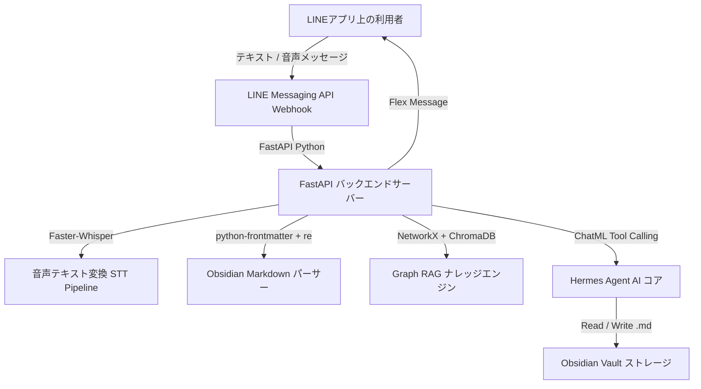

# 要件定義書

作成者: AIナレッジ製品チーム（PL）  
作成日時: 2026年10月5日  
最終更新者: ド（PM）  
最終更新日時: 2026年10月6日  
ステータス: 進行中  

# 人を天才にするAIプロダクト（Second Brain AI）_要件定義書_v1.0

**要　件　定　義　書**

人を天才にするAIプロダクト（Second Brain AI）

LINE公式アカウント（Messaging API） ＋ Python FastAPI ＋ Obsidian Vault ＋ Hermes Agent

Phase 1 — 最小機能版（MVP / PoC Core Engine）

| **文書番号** | SB-AI-REQ-001 |
| --- | --- |
| **版数** | v1.0 |
| **作成日** | 2026年10月5日 |
| **更新日** | 2026年10月6日 |
| **プロジェクト責任者** | ド（PM・株式会社バロッコ） |
| **開発メンバー** | バロッコ開発チーム（Khoi, Pho, An） |
| **レビュー担当** | 日本側パートナー／JP Leadership |
| **前バージョン** | なし（初版） |

---

## 目次

1. [文書概要](#1-文書概要)
2. [システム概要](#2-システム概要)
3. [利用者・アクター定義](#3-利用者アクター定義)
4. [機能要件一覧](#4-機能要件一覧)
5. [API一覧](#5-api一覧)
6. [非機能要件・アーキテクチャ要件](#6-非機能要件アーキテクチャ要件)
7. [段階的ロードマップ（全3フェーズ）](#7-段階的ロードマップ全3フェーズ)

---

## 1. 文書概要

### 1.1 目的

本書は「人を天才にするAIプロダクト（Second Brain AI）」構築に関する要件定義書である。

本システムの目的は、個人の思考やナレッジを蓄積・活用する **「第二の脳（Second Brain）」** を構築することである：
- **LINE Bot** を操作画面とし、音声・テキストによる「1タッチ」の簡易入力を実現する。
- **Obsidian Vault**（ローカル `.md` ファイル）をZettelkasten手法に基づく長期ナレッジストレージとする。
- **Hermes Agent（Nous Research）** ＋ Python FastAPI バックエンドが、自動でFrontmatterメタデータや `[[Wiki-links]]` 双方向リンクを付与し、経営視点ペルソナ（CEO、CFO、CMO）としてのアドバイスを提供する。

### 1.2 開発フェーズとスコープ（Phases）

| **フェーズ** | **目標** | **主要スコープ** |
| --- | --- | --- |
| **Phase 1（MVP / PoC Core）** | 1タッチ入力と自動Vault保存の検証 | LINE Webhook、Faster-Whisper 音声STT、Pythonパーサー（`python-frontmatter` + `re`）、Hermes Agent Tool Calling (`<tool_call>`) によるメタデータ・Wiki-links自動付与。 |
| **Phase 2（Graph RAG & Indexing）** | 文脈を逃さないインテリジェント検索 | Vector DB（ChromaDB） ＋ `networkx` グラフ探索（Wiki-Link Graph Traversal）の統合。 |
| **Phase 3（Multi-Persona & UX）** | 多角的アドバイス ＆ 過去メモ編集 | 経営視点ペルソナ（CEO、CFO、CMO）ChatMLプロンプト、LINEからの過去メモ編集・追記機能。全体受入（UAT）＆リリース。 |

---

## 2. システム概要

### 2.1 システム構成のコンセプト

### 2.2 利用者の体験フロー（User Experience Flow）

1. **入力 (Quick Capture):** 利用者がLINE上で音声メモを録音送信、または短文テキストを送信する。
2. **変換と解釈:** Pythonバックエンドが **Faster-Whisper** で音声をテキスト化し、**Hermes Agent** へ渡す。
3. **解析と自動リンク:** Hermes Agent が内容を理解し、以下を自動生成する：
   - **Frontmatter Metadata:** `tags: [#meeting, #strategy]`, `date: 2026-10-06` を付与。
   - **Wiki-links:** 重要なエンティティを `[[Kenichi]]`, `[[Ke hoach Q4]]` のように双方向リンク化。
4. **Vault保存:** Hermes Agent が `<tool_call>` を生み出し、`create_new_linked_note` ツールで Vault 内へ完全な `.md` ファイルを書き込む。
5. **返答:** LINE Bot がカード型の Flex Message で「新しいメモを第二の脳へ保存しました！」と完了通知を返す。

---

## 3. 利用者・アクター定義

| **ID** | **Role ID** | **種別** | **アクター名** | **主な操作** |
| --- | --- | --- | --- | --- |
| UT-01 | RL-01 | User | 個人利用者（エグゼクティブ） | 音声メモ録音、LINEチャット、ナレッジ検索、Flex Messageボタンでの過去メモ編集操作。 |
| UT-02 | RL-02 | AI System | Hermes Agent (Nous Research) | ChatMLプロンプト受信、`<tool_call>` 発行、ペルソナ別回答（CEO、CFO、CMO）。 |
| UT-03 | RL-03 | Operator | 運用・開発チーム | FastAPI ログ監視、Obsidian Vault 構造確認、System Prompts の更新。 |

---

## 4. 機能要件一覧

| **機能ID** | **機能名** | **機能要件概要** | **スコープ** | **優先度** |
| --- | --- | --- | --- | --- |
| **FR-U01** | 音声メモ受信・STT変換機能 | LINE Webhookから音声ファイルを受信し、Faster-Whisper で高精度テキスト化する機能 | Phase 1 | 必須 |
| **FR-U02** | YAML Frontmatter 自動解析機能 | 発話内容からタグ・日付・カテゴリなどのメタデータを自動抽出・付与する機能 | Phase 1 | 必須 |
| **FR-U03** | Wiki-links (`[[...]]`) 自動付与機能 | エンティティを自動検知し、双方向リンク `[[Note]]` へ変換する機能 | Phase 1 | 必須 |
| **FR-U04** | Hermes Agent Tool Calling 機能 | `<tool_call>` を発行し、自動でVaultの参照・新規作成・更新を行う機能 | Phase 1 | 必須 |
| **FR-U05** | LINE Flex Message 返答機能 | 検索結果や保存完了通知をカード型UIで視覚的に返答する機能 | Phase 1 | 必須 |
| **FR-U06** | Graph RAG Traversal 検索機能 | Vector Search（ChromaDB） ＋ NetworkX グラフ探索による文脈補完検索機能 | Phase 2 | 高 |
| **FR-U07** | Multi-Persona 思考アドバイス機能 | 経営視点ペルソナ（CEO、CFO、CMO、Second Brain）としてアドバイスする機能 | Phase 3 | 高 |
| **FR-U08** | 過去メモ追記・編集機能 | LINEからの指示またはボタン操作で、既存の `.md` メモへ追記・編集する機能 | Phase 3 | 必須 |

---

## 5. API一覧 (FastAPI Python)

| **API ID** | **API名称** | **処理概要** | **技術スタック** |
| --- | --- | --- | --- |
| **API-U01** | LINE Webhook 受信API | 署名検証、テキスト・音声メッセージの受信 | `line-bot-sdk-python` + FastAPI |
| **API-U02** | Faster-Whisper STT API | `.m4a` / `.wav` 音声ファイルのテキスト化 | `faster-whisper` (Python) |
| **API-U03** | Obsidian Markdown Parser API | YAMLメタデータ分離 ＆ Wiki-links `[[...]]` の抽出 | `python-frontmatter` + `re` |
| **API-U04** | NetworkX Graph Engine API | ナレッジグラフ（Nodes, Edges）構築 ＆ Backlinks 算出 | `networkx` (Python) |
| **API-U05** | Hermes Agent Core API | ChatMLフォーマット管理（`<tools>`, `<tool_call>`, `<tool_response>`） | OpenRouter / vLLM / Ollama |
| **API-U06** | Update Note API | 過去の Obsidian `.md` メモに対する追記・編集処理 | Python `pathlib` |

---

## 6. 非機能要件・アーキテクチャ要件

| **ID** | **カテゴリ** | **要求概要** | **技術ソリューション** |
| --- | --- | --- | --- |
| **NFR-01** | バックエンド言語 | 全体を **Python 3.10+** に統一 | FastAPI + Uvicorn ASGI Server |
| **NFR-02** | 応答性能 | LINEへの一次応答を < 5〜10 秒以内に返答 | 非同期Web処理 (`async/await`) |
| **NFR-03** | データ保全性 | Local-first な Markdown テキスト保存 | サーバー内 `.md` Vault 保存 |
| **NFR-04** | AIコーディング支援 | Copilot / Cursor 活用による工数50%削減 | コーディング規約とAI Contextの標準化 |

---

## 7. 段階的ロードマップ（全3フェーズ）

* **Phase 1（MVP / PoC Core Engine - 10営業日 / 10人日）**:
  - 担当: Pho (Dev Obsidian & Parser)、Khoi (Dev LINE & Voice STT)、An (Dev Hermes Agent)、ド (PM)。
  - LINE Bot 1タッチ入力 -> Faster-Whisper STT -> Python Parser -> Hermes Agent Tool Calling による自動Vault保存の完結。
* **Phase 2（Graph RAG & Indexing - 6営業日 / 6人日）**:
  - ChromaDB Vector DB ＋ NetworkX Graph Traversal 統合。
* **Phase 3（Multi-Persona & 過去メモ編集 - 6営業日 / 6人日）**:
  - Multi-Persona System Prompts (CEO, CFO, CMO) ＋ LINEからの過去メモ編集 ＋ 全体UAT受入 ＆ リリース。
