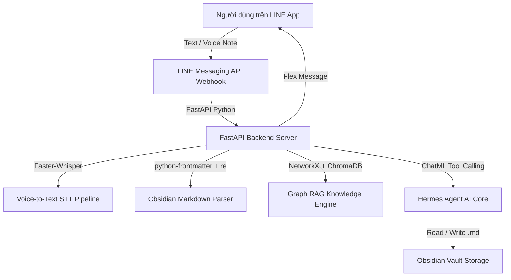

# Tài liệu Định nghĩa Yêu cầu

Người tạo: Team Sản phẩm AI Tri thức (PL)  
Ngày giờ tạo: 2026年10月5日  
Người cập nhật cuối: Độ (PM)  
Ngày giờ cập nhật cuối: 2026年10月6日  
Trạng thái: Đang tiến hành  

> Bản tiếng Việt để duyệt nội bộ. Bản gốc (gửi khách / Barocco / JP): `docs/requiments/要件定義書.md`

# Sản phẩm AI Biến Con Người Thành Thiên Tài (Second Brain AI)_Tài liệu định nghĩa yêu cầu_v1.0

**TÀI LIỆU ĐỊNH NGHĨA YÊU CẦU**

Sản phẩm AI biến con người thành thiên tài (人を天才にするAIプロダクト / Second Brain AI)

Tài khoản chính thức LINE (Messaging API) ＋ Backend Python FastAPI ＋ Obsidian Vault ＋ Hermes Agent

Phase 1 — Bản chức năng tối thiểu (MVP / PoC Core Engine)

| **Số văn bản** | SB-AI-REQ-001 |
| --- | --- |
| **Phiên bản** | v1.0 |
| **Ngày tạo** | 2026年10月5日 |
| **Ngày cập nhật** | 2026年10月6日 |
| **Người chịu trách nhiệm dự án** | Độ (PM - Barocco) |
| **Thành viên phát triển** | Đội phát triển Barocco (Khôi, Phú, An) |
| **Người review** | JP Leadership / Khách hàng Nhật Bản |
| **Phiên bản trước** | Không (bản đầu) |

---

## Mục lục

1. [Tổng quan văn bản](#1-tổng-quan-văn-bản)
2. [Tổng quan hệ thống](#2-tổng-quan-hệ-thống)
3. [Định nghĩa người dùng / actor](#3-định-nghĩa-người-dùng--actor)
4. [Danh sách yêu cầu chức năng](#4-danh-sách-yêu-cầu-chức-năng)
5. [Danh sách màn hình / đặc tả màn hình](#5-danh-sách-màn-hình--đặc-tả-màn-hình)
6. [Danh sách API](#6-danh-sách-api)
7. [Danh sách entity](#7-danh-sách-entity)
8. [Danh sách batch & thông báo](#8-danh-sách-batch--thông-báo)
9. [Yêu cầu phi chức năng & Kiến trúc](#9-yêu-cầu-phi-chức-năng--kiến-trúc)
10. [Lộ trình theo 3 giai đoạn (Phases)](#10-lộ-trình-theo-3-giai-đoạn-phases)

---

## 1. Tổng quan văn bản

### 1.1 Mục đích

Tài liệu này định nghĩa chi tiết các yêu cầu kỹ thuật và nghiệp vụ cho dự án **Sản phẩm AI biến con người thành thiên tài (Second Brain AI)**. 

Mục tiêu chính là xây dựng một **Bộ Não Thứ Hai** cá nhân hóa cho người dùng: 
- Lấy ứng dụng **LINE** làm giao diện nhập liệu "1-chạm" tối giản (qua Giọng nói / Text).
- Lấy **Obsidian Vault** (.md local files) làm trung tâm lưu trữ tri thức lâu dài theo phương pháp Zettelkasten.
- Lấy mô hình **Hermes Agent (Nous Research)** trên nền Python FastAPI làm "bộ não trí tuệ" tự động bóc tách Frontmatter metadata, tự động gán liên kết 2 chiều `[[Wiki-links]]`, và đóng vai cố vấn chiến lược Multi-Persona (CEO, CFO, CMO).

### 1.2 Giai đoạn phát triển và phạm vi (Phases)

| **Giai đoạn** | **Mục tiêu** | **Phạm vi chính** |
| --- | --- | --- |
| **Phase 1 (MVP / PoC Core)** | Kiểm chứng luồng nhập liệu 1-chạm & lưu Vault tự động | Webhook LINE Bot, Voice STT (Faster-Whisper), Python Parser (`python-frontmatter` + `re`), Hermes Agent Tool Calling (`<tool_call>`) tự động gán metadata & Wiki-links. |
| **Phase 2 (Graph RAG & Indexing)** | Truy vấn tri thức thông minh không mất ngữ cảnh | Tích hợp Vector DB (ChromaDB) + Duyệt đồ thị liên kết NetworkX (Wiki-Link Graph Traversal). |
| **Phase 3 (Multi-Persona & UX)** | Cố vấn đa góc nhìn & Chỉnh sửa note cũ | Hoàn thiện bộ Prompt ChatML (CEO, CFO, CMO), chức năng ra lệnh giọng nói/chat hoặc Flex Message để sửa/nối nội dung note cũ. UAT & Release. |

---

## 2. Tổng quan hệ thống

### 2.1 Cấu trúc hệ thống tổng thể

### 2.2 Luồng trải nghiệm người dùng (User Experience Flow)

1. **Nhập liệu (Quick Capture):** Người dùng bấm thu âm gửi Voice note hoặc nhắn 1 câu qua LINE.
2. **Chuyển thoại & Diễn giải:** Backend Python dùng **Faster-Whisper** đổi voice thành chữ, truyền tiếp cho **Hermes Agent**.
3. **Phân tích & Tự liên kết:** Hermes Agent tự suy luận và bóc tách:
   - **Frontmatter Metadata:** Gán `tags: [#meeting, #strategy]`, `date: 2026-10-06`.
   - **Wiki-links:** Tự bọc các thực thể quan trọng thành `[[Kenichi]]`, `[[Ke hoach Q4]]`.
4. **Lưu Vault:** Hermes Agent phát lệnh gọi tool `create_new_linked_note` để ghi file `.md` hoàn chỉnh vào Vault.
5. **Phản hồi:** LINE Bot gửi thẻ Flex Message đẹp mắt xác nhận: *"Đã lưu ghi chú mới vào Bộ Não Thứ Hai!"*.

---

## 3. Định nghĩa người dùng / actor

| **ID** | **Role ID** | **Loại** | **Tên Actor** | **Thao tác chính** |
| --- | --- | --- | --- | --- |
| UT-01 | RL-01 | User | Người dùng cá nhân (Executive) | Thu âm voice note, chat LINE, tra cứu tri thức, thao tác nút bấm Flex Message sửa note cũ. |
| UT-02 | RL-02 | AI System | Hermes Agent (Nous Research) | Nhận prompt ChatML, phát lệnh `<tool_call>`, tư vấn Multi-Persona (CEO, CFO, CMO). |
| UT-03 | RL-03 | Operator | Đội ngũ quản trị / Dev | Giám sát log FastAPI, kiểm tra dữ liệu Obsidian Vault, cập nhật System Prompts. |

---

## 4. Danh sách yêu cầu chức năng

### 4.1 Chức năng phía người dùng (LINE Bot & AI Agent)

| **Mã CN** | **Tên chức năng** | **Mô tả yêu cầu** | **Phạm vi** | **Ưu tiên** |
| --- | --- | --- | --- | --- |
| **FR-U01** | Nhận Voice Note & Dịch STT | Tiếp nhận file âm thanh từ LINE Webhook và dịch thành chữ bằng Faster-Whisper | Phase 1 | Bắt buộc |
| **FR-U02** | Tự động bóc tách YAML Frontmatter | Tự phân tích thẻ tag, ngày tháng, danh mục từ câu nói của user | Phase 1 | Bắt buộc |
| **FR-U03** | Tự động gán Wiki-links `[[...]]` | Nhận diện thực thể trong câu và bọc thành liên kết 2 chiều `[[Note]]` | Phase 1 | Bắt buộc |
| **FR-U04** | Hermes Agent Tool Calling Loop | Agent phát lệnh `<tool_call>` để tự động tra cứu, tạo hoặc sửa file `.md` | Phase 1 | Bắt buộc |
| **FR-U05** | Phản hồi LINE Flex Messages | Trả kết quả tư vấn & nút bấm tương tác dưới dạng thẻ giao diện Flex Message | Phase 1 | Bắt buộc |
| **FR-U06** | Graph RAG Traversal Search | Kết hợp Vector Search (ChromaDB) + Duyệt đồ thị `networkx` nhảy theo Wiki-links | Phase 2 | Cao |
| **FR-U07** | Multi-Persona Strategic Counseling | Đóng vai tư vấn góc nhìn quản trị: CEO, CFO, CMO, Second Brain Alter-Ego | Phase 3 | Cao |
| **FR-U08** | Ra lệnh Chỉnh sửa Note cũ | Cho phép ra lệnh bằng giọng nói/chat hoặc bấm nút trên LINE để sửa/nối nội dung note cũ | Phase 3 | Bắt buộc |

---

## 5. Danh sách API Backend (FastAPI Python)

| **Mã API** | **Tên API** | **Tóm tắt xử lý** | **Công nghệ** |
| --- | --- | --- | --- |
| **API-U01** | LINE Webhook Receiver | Xác minh chữ ký LINE, tiếp nhận tin nhắn văn bản & voice note | `line-bot-sdk-python` + FastAPI |
| **API-U02** | Faster-Whisper STT | Chuyển đổi file âm thanh `.m4a`/`.wav` thành văn bản chữ | `faster-whisper` (Python) |
| **API-U03** | Obsidian Markdown Parser | Bóc tách YAML metadata & trích xuất danh sách Wiki-links `[[...]]` | `python-frontmatter` + `re` |
| **API-U04** | NetworkX Graph Engine | Dựng đồ thị tri thức (Nodes, Edges) và tính toán Backlinks | `networkx` (Python) |
| **API-U05** | Hermes Agent Core API | Quản lý ChatML format (`<tools>`, `<tool_call>`, `<tool_response>`) | OpenRouter / vLLM / Ollama |
| **API-U06** | Update Note API | Tiếp nhận yêu cầu nối/sửa nội dung cho bài viết Obsidian cũ | Python `pathlib` |

---

## 6. Yêu cầu Phi chức năng & Kiến trúc

| **Mã ID** | **Hạng mục** | **Yêu cầu chi tiết** | **Giải pháp kỹ thuật** |
| --- | --- | --- | --- |
| **NFR-01** | Ngôn ngữ Backend | Thống nhất 100% bằng **Python 3.10+** | FastAPI + Uvicorn ASGI Server |
| **NFR-02** | Tốc độ phản hồi | Phản hồi câu trả lời trên LINE trong vòng < 5-10 giây | Xử lý Webhook bất đồng bộ (`async/await`) |
| **NFR-03** | Bảo mật dữ liệu | Lưu trữ dữ liệu Local-first dưới dạng Markdown thuần | File `.md` lưu an toàn trên Server/Vault |
| **NFR-04** | Hỗ trợ AI Coding | Tận dụng Copilot/Cursor để rút ngắn 50% thời gian phát triển | Chuẩn hóa code structure & AI Context |

---

## 7. Lộ trình Triển khai theo 3 Giai đoạn (Phases)

* **Phase 1 (MVP / PoC Core Engine - 10 ngày làm việc / 10 ngày-người):**
  - Đội ngũ: Phú (Dev Obsidian & Parser), Khôi (Dev LINE & Voice STT), An (Dev Hermes Agent), Độ (PM).
  - Hoàn thiện luồng nhập liệu 1-chạm LINE Bot -> Faster-Whisper STT -> Python Parser -> Hermes Agent Tool Calling tự động lưu `.md` Vault.
* **Phase 2 (Graph RAG & Indexing - 6 ngày làm việc / 6 ngày-người):**
  - Tích hợp ChromaDB Vector DB + NetworkX Wiki-link Traversal.
* **Phase 3 (Multi-Persona & Sửa Note cũ - 6 ngày làm việc / 6 ngày-người):**
  - Multi-Persona Prompts (CEO, CFO, CMO) + Ra lệnh sửa note cũ từ LINE Bot + UAT & Release toàn bộ hệ thống.
